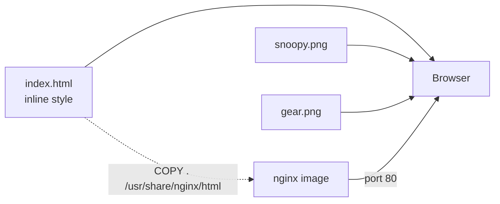

# Architecture

One HTML file, two images, no build step. `index.html` carries its own CSS in
an inline `<style>` block, so the page has no external stylesheet, no script,
and no network request beyond the two images beside it.

## Overview

The same three files are served two ways: copied onto any static host, or
baked into an nginx image.



## Components

### `index.html`

The whole page: markup, an inline `<style>` block, and four `%...%`
placeholders left as plain text for the user to replace. Roughly 150 lines.

Colours are declared twice — once for light mode, once inside a
`prefers-color-scheme: dark` media query — which is what makes the page follow
the visitor's system theme with no JavaScript.

### `snoopy.png` and `gear.png`

The illustration and the theme icon. Referenced by relative path, so all three
files must be deployed into the same directory.

### `Dockerfile`

Four lines on top of `nginx:stable`. It copies the repository into
`/usr/share/nginx/html` and sets an authors label. Because it copies at build
time rather than mounting, an edited `index.html` needs a rebuild to appear in
the container.

## Data flow

There is no request handling to describe. A visitor requests `index.html`, the
browser parses the inline stylesheet, applies the light or dark palette from
`prefers-color-scheme`, and requests the two images. Nothing is dynamic and
nothing is stored.

## Directory layout

```text
.
├── index.html         The entire page, including its CSS
├── snoopy.png         Main illustration
├── gear.png           Theme icon
├── Dockerfile         nginx:stable + COPY
├── PLANNING.md        Project notes
└── docs/              Source for this site
```

## Design decisions

**Everything inline.** The CSS lives in the HTML rather than a separate file so
that deploying is a copy rather than a build, and so a user can personalise the
page with nothing but a text editor. The cost is that the stylesheet cannot be
cached separately or shared with another page — irrelevant for a single
holding page.

**Placeholders as plain text.** `%insert_time_here%` and friends are literal
strings rather than a templating syntax, so any editor's find-and-replace does
the job and no tooling is required.

**Published twice.** The static files suit someone dropping a holding page onto
existing hosting; the container suits someone who wants it running immediately.
Both come from the same three files, so they cannot drift.

{{ support() }}
